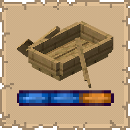

# Smooth Sail
   

## Installation
   
* [Modrinth](https://modrinth.com/mod/smooth-sail)
* [CurseForge](https://www.curseforge.com/minecraft/mc-mods/smooth-sail)

## Support
   
If you encounter bugs or wish to contribute:
* [Report any problems you find.](https://github.com/armaninyow/Smooth-Sail/discussions/categories/issues)
* [Share your ideas for new features.](https://github.com/armaninyow/Smooth-Sail/discussions/categories/suggestions)

## Changelog

  

   
### 2.0.0—26.x
* Added support for Minecraft 26.1, 26.1.1, and 26.1.2
### 1.1.0—1.21.x
* Added server-side opt-in handshake. Smooth steering and the HUD now only activate when the server has the mod installed. This ensures fair multiplayer play
* Merged 1.21.2-1.21.5 into a single version range due to shared rendering API compatibility
* Merged 1.21.6-1.21.10 into a single version range due to shared rendering API compatibility
### 1.0.0—1.21.x
* Initial Release

